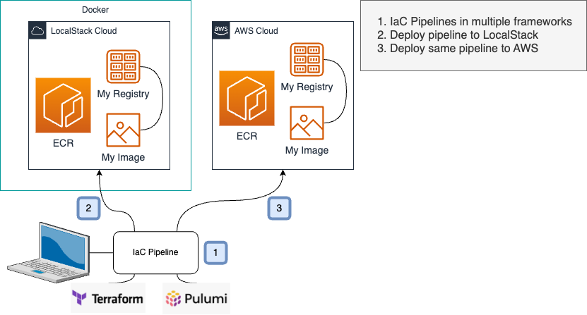

# LocalStack ECR Project

This project uses mutliple IaC frameworks to deploy a Docker registry to AWS ECR, build a Docker image,
and deploy the image to the ECR repo. Changes to files in the `./app` directory will cause the Docker
image to be rebuilt with the tag `latest` and redeployed.



# Setup

### Assumptions

- Latest DockerDesktop installed and running

### Setup steps

1. Install Node Version Manager (NVM)
   https://github.com/nvm-sh/nvm#installing-and-updating
2. Select Node version 18

```shell
nvm install 18
```

3. Install Terraform CDK

```shell
npm install --global cdktf-cli@latest
```

4. Create a Python VENV (virtual env) and Install LocalStack CLI

```shell
make setup-venv
# make sure to use the venv by sourcing it
source venv/bin/activate
```

5. Start LocalStack

```shell
# Export your LocalStack license key
export LOCALSTACK_API_KEY=<your key>
make start-localstack
```

The above command will hang. You can shutdown LocalStack by running:

```shell
make stop-localstack
```

# Terraform CDK IaC Instructions

This assumes your shells are using the NVM by running `nvm use node` and you have your python venv set by
running `source venv/bin/activate`

### Install pipeline packages

You need to do this initially, and if you manually add packages to `iac/terraform/cdk/package.json`

```shell
make local-cdktf-install
```

### Deploy ECR Stack

```shell
make local-cdktf-deploy
```

## Terraform CDK Poking Around

Look in the `./app` directory to find the Dockerfile. You can modify it and re-run `make local-cdktf-deploy` and it will
re-deploy.

Look in the `./iac/terraform/cdk` directory to find the IaC project. Look at `main.ts` in there to see how the resources
are created.

### Dev Testing the Image

#### Sample Workflow

Assuming you've deployed everything above.

1. Change the image. Modify the file `./app/Dockerfile`
2. Run a container for our image

```shell
docker run --rm localhost.localstack.cloud:4510/myrepo
```

3. Update the `./app/Dockerfile` again
4. Re-deploy

```shell 
make local-cdktf-deploy
```

5. Run the container for our image again, see the difference you made to the image.

```shell
docker run --rm localhost.localstack.cloud:4510/myrepo
```

6. Go back to step (3)

# Pulumi IaC with Docker Provider Instructions

IaC files located at `./iac/pulumi/ts-docker-provider/ecr`

### Deploy with Pulumi IaC

```shell
unset AWS_PROFILE
```

```shell
make local-ecr-docker-deploy
```

### Pulumi Cleanup

When you restart LocalStack, you want to cleanup the local Pulumi state.

```shell
make local-pulumi-clean
```

# Pulumi Crosswalk IaC Instructions - Failing

There is an issue with the ECR deployment to LocalStack in this IaC pipeline right now.
IaC files located at `./iac/pulumi/typescript/ecr`

### Deploy with Pulumi IaC

```shell
unset AWS_PROFILE
```

```shell
make local-ecr-deploy
```

# AWS Deploy Instructions

We use the same IaC pipelines to deploy to AWS! This is a very important point that LocalStack enables teams
to test their IaC pipelines locally before ever deploying them to a live AWS environment.

## Set Live AWS Credentials

However you set your credentials in your terminal, do it now.

## Add Environment Config

This project stores Terraform state in an AWS S3 bucket in the target account.
Create an S3 bucket in your target account to hold the Terraform state

```shell
aws s3 mb s3://<name of your bucket>-<region where bucket is> --region <region where your bucket is>
# enable versioning in case of state corruption
aws s3api put-bucket-versioning --bucket <your full bucket name> --versioning-configuration Status=Enabled
```

Create a file called `nonenv.makefile` at the root of this project.

```makefile
non%: export TERRAFORM_STATE_BUCKET=<your bucket name. ie my-happy-bucket-us-west-2>
non%: export PULUMI_BACKEND_URL=s3://$(TERRAFORM_STATE_BUCKET)
```

## Deploy to AWS with Pulumi

```shell
make non-ecr-docker-deploy
```

## Destroy the Deployed AWS Pulumi Stack

```shell
make non-ecr-docker-destroy
```

## Deploy to AWS with Terraform-CDK

```shell
make non-cdktf-deploy
```

## Destroy the Deployed Stack

```shell
make non-cdktf-destroy
```